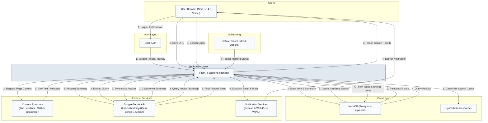

# FlowDesk Architecture

This document details the system design and technology choices for FlowDesk.

## 🏗 System Overview

## 🛠 Design Rationale

| Component | Choice | Why? |
| :--- | :--- | :--- |
| **Database** | **NeonDB + pgvector** | avoids separate vector DB, joins between relational and vector data are trivial SQL, free tier includes pgvector |
| **API Framework** | **FastAPI over Spring Boot** | native Python AI ecosystem integration, async-first, 10x less boilerplate for this type of API |
| **Web Ingestion** | **Jina AI Reader over Playwright** | zero memory overhead on Render's 512MB dyno, handles JS rendering server-side, no maintenance |
| **Job Scheduling** | **UptimeRobot over APScheduler** | decoupled from Render's sleep cycle, stateless backend (important for free tier reliability) |
| **Email Service** | **Resend over SendGrid** | 100 emails/day free with a modern API, better developer experience |
| **Cache Store** | **Upstash Redis over Redis Cloud** | serverless REST API fits perfectly in Render's stateless dyno model |
