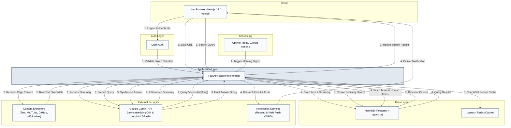

# FlowDesk
> A unified personal productivity system combining a smart task planner with an AI-powered knowledge base.

FlowDesk is a full-stack application built to solve my own context-switching problem. It bridges the gap between daily task execution and long-term knowledge retention. By integrating a multi-horizon task planner with a Retrieval-Augmented Generation (RAG) pipeline, it allows users to save content from across the web, summarize it instantly, and search their personal knowledge base using natural language.

## 🚀 Key Features & Technical Highlights

* **🧠 AI-Powered Knowledge Base (RAG):** Natural language semantic search powered by Google Gemini 1.5 Flash and `text-embedding-004`. Uses Postgres + `pgvector` with HNSW indexing instead of a managed vector database to keep infrastructure simple and tightly coupled to user data.
* **📥 Omni-Source Ingestion Pipeline:** 100% free-tier background extraction pipeline handling 6 distinct content types (Articles, YouTube, GitHub Repos, Twitter, LinkedIn, PDFs). Uses `asyncio` background tasks to keep the main event loop unblocked.
* **✅ Multi-Horizon Task Planning:** Organize tasks across daily, weekly, and monthly scopes. Fully optimized N+2 query architecture for rendering complex dashboards without database strain.
* **🔔 Resilient Notification Engine:** Smart morning digests sent via Resend (Email) and Web Push (VAPID). Triggered by an external UptimeRobot cron job guarded by a strictly idempotent, time-window-gated endpoint (with GitHub Actions as a fallback).
* **⚡ Production-Ready Backend Patterns:** Built with `asyncpg` + SQLAlchemy 2.0. Features strict ownership-scoped database queries, Alembic migrations, cache-aside Redis implementation, and connection pooling tailored for NeonDB serverless cold starts.
* **💸 Zero-Cost Architecture:** The entire system is architected to run reliably on the free tiers of Vercel, Render, Neon, Upstash, and Google AI Studio. 

---

## 🏗 System Architecture

FlowDesk relies on a decoupled frontend/backend architecture, utilizing serverless functions and background workers to ensure the main API thread remains fast and responsive during heavy LLM and web-scraping operations.



---

## 🛠 Tech Stack

| Domain | Technologies |
| :--- | :--- |
| **Frontend** | Next.js 14 (App Router), TypeScript, Tailwind CSS, shadcn/ui |
| **Backend** | FastAPI, Python 3.11, Pydantic v2 |
| **Database & ORM** | PostgreSQL (NeonDB), `pgvector`, SQLAlchemy 2.0 (Async), Alembic |
| **AI / NLP** | LangChain, Google Gemini API (`1.5-flash`, `text-embedding-004`) |
| **Caching** | Upstash Redis (Serverless REST API) |
| **Extraction** | Jina AI Reader, YouTube Transcript API, `pdfplumber` |
| **Infrastructure** | Vercel (Web), Render (API), Clerk (Auth), Resend (Email) |

---

## ⚙️ Getting Started

### Prerequisites
* Node.js 18+
* Python 3.11+
* Accounts for: [NeonDB](https://neon.tech/), [Clerk](https://clerk.com/), [Upstash](https://upstash.com/), [Resend](https://resend.com/)
* [Google Gemini API Key](https://aistudio.google.com/)

### 1. Backend Setup
```bash
# Clone the repository
git clone https://github.com/yourusername/flowdesk.git
cd flowdesk/backend

# Create and activate virtual environment
python -m venv venv
source venv/bin/activate  # On Windows use `venv\Scripts\activate`

# Install dependencies
pip install -r requirements.txt

# Set up your .env file (see Environment Variables section below)
cp .env.example .env

# Run database migrations
alembic upgrade head

# Start the FastAPI server
uvicorn main:app --reload --port 8000
```

### 2. Frontend Setup
```bash
cd ../frontend

# Install dependencies
npm install

# Set up your .env.local file
cp .env.example .env.local

# Start the Next.js development server
npm run dev
```

### 3. First-Time Database Setup
Before testing the RAG pipeline, you must enable the pgvector extension and initialize the HNSW index. Connect to your NeonDB SQL editor and run:
```sql
CREATE EXTENSION IF NOT EXISTS vector;
```
*(Note: The vector index creation is handled safely within the Alembic migrations, assuming the extension is enabled).*

---

## 🔐 Environment Variables Reference

### Backend (`backend/.env`)

| Variable | Description | Where to get it | Required? |
| :--- | :--- | :--- | :--- |
| `DATABASE_URL` | Postgres connection string (use `postgresql+asyncpg://`) | NeonDB Dashboard | Yes |
| `GEMINI_API_KEY` | Key for embeddings and summaries | Google AI Studio | Yes |
| `UPSTASH_REDIS_REST_URL` | Redis REST API URL | Upstash Dashboard | Yes |
| `UPSTASH_REDIS_REST_TOKEN` | Redis REST API Token | Upstash Dashboard | Yes |
| `RESEND_API_KEY` | Transactional email API key | Resend Dashboard | Yes |
| `NOTIFICATION_SECRET` | Custom shared secret for Cron webhook | Generate yourself | Yes |
| `VAPID_PRIVATE_KEY` | Web Push private key | Generate via `pywebpush` | Yes |
| `VAPID_PUBLIC_KEY` | Web Push public key | Generate via `pywebpush` | Yes |
| `VAPID_CLAIM_EMAIL` | Web Push claim email | Generate yourself | Yes |
| `GEMINI_API_KEY` | Gemini AI key | Google AI Studio | Yes |
| `GITHUB_TOKEN` | Fine-grained PAT for scraping repo READMEs | GitHub Settings | No |

### Frontend (`frontend/.env.local`)

| Variable | Description | Where to get it | Required? |
| :--- | :--- | :--- | :--- |
| `NEXT_PUBLIC_API_URL` | URL of your FastAPI backend | `http://localhost:8000` | Yes |
| `NEXT_PUBLIC_CLERK_PUBLISHABLE_KEY` | Clerk public key | Clerk Dashboard | Yes |
| `CLERK_SECRET_KEY` | Clerk secret key | Clerk Dashboard | Yes |
| `NEXT_PUBLIC_VAPID_PUBLIC_KEY` | Matches backend VAPID public key | Generate yourself | Yes |

---

## 📂 Project Structure

```text
flowdesk/
├── backend/
│   ├── alembic/              # Database migrations
│   ├── core/                 # Config, DB session, Security
│   ├── models/               # SQLAlchemy ORM models (Postgres schema)
│   ├── routers/              # FastAPI route handlers
│   ├── schemas/              # Pydantic v2 validation models
│   ├── services/             # Business logic, AI, Extraction, Notification orchestrators
│   ├── main.py               # FastAPI application entry point
│   └── requirements.txt
└── frontend/
    ├── app/                  # Next.js App Router pages
    ├── components/           # React components (shadcn/ui, custom)
    ├── hooks/                # Custom React hooks (SWR, Web Push)
    ├── lib/                  # Utilities, API fetchers, Types
    └── public/               # Static assets
```

---

## 🧠 Key Design Decisions

**1. `pgvector` over managed vector databases (Pinecone, Weaviate)**
For a personal knowledge base, creating a dedicated cluster on a vector DB introduces unnecessary network latency, infrastructure complexity, and potential synchronization issues (e.g., if a user deletes a row, you must ensure the vector DB cascades the delete). By using the `pgvector` extension in NeonDB with an HNSW index, vector data lives right alongside relational data. This allows for strict foreign-key constraints, automatic cascade deletions, and unified ownership scoping (`WHERE user_id = ?`) before the ANN (Approximate Nearest Neighbor) search executes.

**2. UptimeRobot + Idempotency over Native Cron / Celery Beat**
Running a 24/7 worker node (like Celery Beat) specifically to fire a morning digest cron job breaks the "zero-cost" architectural constraint, as free-tier PaaS environments sleep. Instead, I configured UptimeRobot to ping a specific FastAPI endpoint every 10 minutes. The endpoint validates a shared secret, checks if the current time falls inside the "Morning" window, and uses a Postgres `NotificationLog` table to guarantee idempotency. This effectively mimics a highly reliable cron job in a serverless environment.

**3. FastAPI + Python for the Backend**
While Next.js API routes or Spring Boot are excellent for standard CRUD, Python's ecosystem is simply unmatched for AI/ML and web scraping. Using FastAPI provided the performance of an asynchronous framework (via `asyncpg` and `asyncio.to_thread`) while giving native, first-class access to libraries like `google-generativeai`, `youtube-transcript-api`, and `pdfplumber`. 

**4. Jina AI Reader over Headless Browsers (Playwright)**
Ingesting web articles historically requires spinning up a headless browser to bypass client-side rendering and CAPTCHAs, which blows past the 512MB RAM limits of free-tier hosting. I opted to route standard web URLs through the [Jina AI Reader API](https://jina.ai/reader/). It acts as a lightweight proxy that handles the rendering and returns remarkably clean, LLM-ready Markdown, keeping the backend's memory footprint incredibly low.

---

## 📄 License

This project is licensed under the MIT License - see the [LICENSE](LICENSE) file for details.
