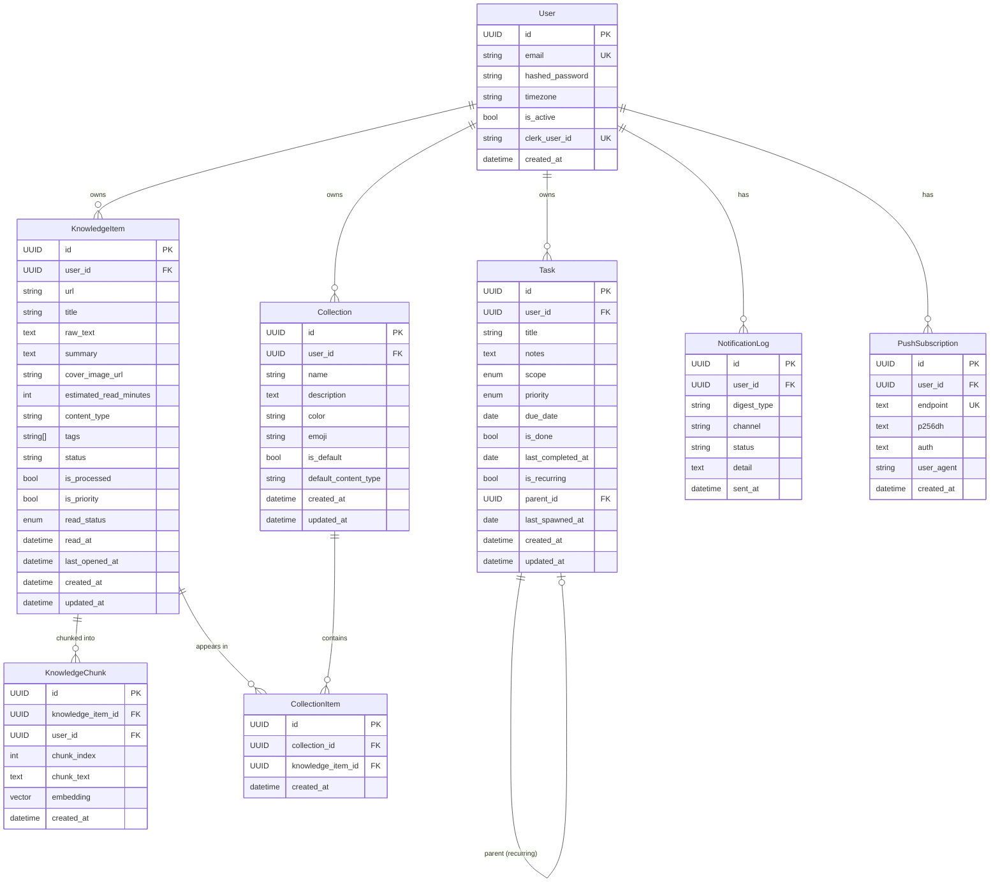

# FlowDesk — Data Models & Database Schema

> **Purpose**: Reference document for all SQLAlchemy ORM models, their columns, relationships, indexes, and design decisions. Use this before working on any database-touching code.

---

## 1. Overview

FlowDesk uses **PostgreSQL** (hosted on NeonDB) with:
- **SQLAlchemy 2.0** (async) as the ORM
- **Alembic** for schema migrations (15 migrations and counting)
- **pgvector** extension for storing and querying 768-dimensional embeddings
- All primary keys are **UUID v4** (not integer sequences)
- All timestamps are **timezone-aware UTC**
- All user-owned data **cascades on delete** — deleting a `User` row removes everything they own

---

## 2. Entity Relationship Diagram

---

## 3. Table-by-Table Reference

### `users`
**File**: `backend/models/user.py`

The root entity. Every other table belongs to a user. Auth is handled by Clerk, but a local `User` row is still required to store the `clerk_user_id` mapping and own all relational data.

| Column | Type | Notes |
|---|---|---|
| `id` | UUID PK | UUID v4, indexed |
| `email` | String | Unique, indexed |
| `hashed_password` | String | bcrypt via passlib (legacy; Clerk handles auth now) |
| `timezone` | String | Default: `"Asia/Kolkata"` |
| `is_active` | Boolean | Default: `True` |
| `clerk_user_id` | String(255) | Nullable. Set on first Clerk-auth'd request. Unique constraint `uq_users_clerk_user_id` |
| `created_at` | DateTime(tz) | UTC timestamp |

**Relationships**:
- `tasks` → `Task` (cascade delete)
- `notifications` → `NotificationLog` (cascade delete)
- `push_subscriptions` → `PushSubscription` (cascade delete)
- `knowledge_items` → `KnowledgeItem` (cascade delete)

---

### `tasks`
**File**: `backend/models/task.py`

Personal task management. Supports scoped planning (daily/weekly/monthly), priority levels, due dates, and recurring tasks.

| Column | Type | Notes |
|---|---|---|
| `id` | UUID PK | |
| `user_id` | UUID FK | → `users.id` CASCADE |
| `title` | String(255) | Required |
| `notes` | Text | Optional |
| `scope` | Enum | `DAILY` / `WEEKLY` / `MONTHLY` |
| `priority` | Enum | `LOW` / `MEDIUM` / `HIGH`. Default: `MEDIUM` |
| `due_date` | Date | Optional |
| `is_done` | Boolean | Default: `False` |
| `last_completed_at` | Date | Tracks when the task was last checked off |
| `is_recurring` | Boolean | Default: `False` |
| `parent_id` | UUID FK (self) | → `tasks.id` SET NULL. Template task for recurring spawns |
| `last_spawned_at` | Date | When the last child was spawned from a recurring template |
| `created_at` | DateTime(tz) | |
| `updated_at` | DateTime(tz) | Auto-updated via `onupdate` |

**Indexes**:
- `ix_tasks_user_id_scope` — composite on `(user_id, scope)` for filtered list queries
- `ix_tasks_user_id_is_done` — composite on `(user_id, is_done)` for completion filters

**Design notes**:
- Recurring tasks use a **parent-child pattern**: the parent task (`is_recurring=True`) is a template. The application spawns child tasks from it on a schedule. `parent_id` is a self-referential FK.

---

### `knowledge_items`
**File**: `backend/models/knowledge.py`

The core knowledge base entity. Stores a saved piece of content — a URL, PDF, YouTube video, or GitHub repo — along with its extracted text, AI summary, and metadata.

| Column | Type | Notes |
|---|---|---|
| `id` | UUID PK | |
| `user_id` | UUID FK | → `users.id` CASCADE |
| `url` | String | Source URL (nullable for manual text) |
| `title` | String | Extracted or user-provided |
| `raw_text` | Text | Full extracted content |
| `summary` | Text | AI-generated summary (Gemini) |
| `cover_image_url` | String | Optional thumbnail |
| `estimated_read_minutes` | Integer | Calculated from word count |
| `content_type` | String | `article` / `youtube` / `github` / `twitter` / `linkedin` / `pdf` |
| `tags` | String[] | PostgreSQL ARRAY of strings |
| `status` | String | `pending` / `processing` / `done` / `failed` |
| `is_processed` | Boolean | `True` once ingestion pipeline completes |
| `is_priority` | Boolean | User-flagged as priority reading |
| `read_status` | Enum | `UNREAD` / `READING` / `DONE` |
| `read_at` | DateTime(tz) | When marked as DONE |
| `last_opened_at` | DateTime(tz) | Last time user opened this item |
| `created_at` | DateTime(tz) | |
| `updated_at` | DateTime(tz) | |

**Indexes**:
- `ix_knowledge_items_user_status` — `(user_id, status)`
- `ix_knowledge_items_user_ctype` — `(user_id, content_type)`
- `ix_knowledge_items_user_read_status` — `(user_id, read_status)`

**Relationships**:
- `chunks` → `KnowledgeChunk` (cascade delete, `lazy="raise"`)
- `collections` → `CollectionItem` (cascade delete)
- `user` → `User`

---

### `knowledge_chunks`
**File**: `backend/models/knowledge_chunk.py`

Stores text chunks from a `KnowledgeItem` along with their **768-dimensional vector embeddings** (from `gemini-embedding-2`). Powers the semantic search (RAG) pipeline.

| Column | Type | Notes |
|---|---|---|
| `id` | UUID PK | Generated by `gen_random_uuid()` server-side |
| `knowledge_item_id` | UUID FK | → `knowledge_items.id` CASCADE |
| `user_id` | UUID FK | **Denormalised** from `knowledge_items`. Avoids JOIN during ANN searches — this is the standard pgvector multi-tenant pattern |
| `chunk_index` | Integer | 0-based position within the parent item |
| `chunk_text` | Text | The actual text of this chunk |
| `embedding` | Vector(768) | pgvector column — 768 floats |
| `created_at` | DateTime(tz) | |

**Indexes**:
- `ix_kc_user_id` — B-tree on `user_id` (pre-filter before ANN scan)
- `ix_kc_knowledge_item_id` — B-tree on `knowledge_item_id` (for deletion/re-embedding)
- `ix_kc_embedding_hnsw` — **HNSW vector index** created via raw SQL in Alembic migration (cannot be declared in SQLAlchemy `__table_args__`)

**Vector index decision — HNSW over IVFFlat**:

> HNSW was chosen because:
> 1. No training phase — IVFFlat breaks on empty/small tables (requires REINDEX after growth)
> 2. Better recall for small-to-medium datasets (< 1M vectors)
> 3. Incremental inserts keep the graph valid — important for continuous ingestion
> 
> Config: `m=16, ef_construction=64, vector_cosine_ops` (cosine distance, since Gemini embeddings are unit-normalised)

---

### `collections`
**File**: `backend/models/knowledge.py`

Groups of `KnowledgeItem`s. Can be user-created or **system auto-created** (one per content_type, e.g., an "Articles" collection automatically created when the first article is saved).

| Column | Type | Notes |
|---|---|---|
| `id` | UUID PK | |
| `user_id` | UUID FK | → `users.id` CASCADE |
| `name` | String | Collection name |
| `description` | Text | Optional |
| `color` | String(7) | Hex color e.g. `"#6366f1"` |
| `emoji` | String(8) | e.g. `"📰"` |
| `is_default` | Boolean | `True` = system-created, cannot be deleted by user |
| `default_content_type` | String | Which `content_type` this default collection maps to |
| `created_at` | DateTime(tz) | |
| `updated_at` | DateTime(tz) | |

**Index**: `ix_collections_user_id` on `user_id`

---

### `collection_items`
**File**: `backend/models/knowledge.py`

A **junction table** linking `KnowledgeItem` ↔ `Collection`. Many-to-many: one item can be in multiple collections, one collection can hold many items.

| Column | Type | Notes |
|---|---|---|
| `id` | UUID PK | |
| `collection_id` | UUID FK | → `collections.id` CASCADE |
| `knowledge_item_id` | UUID FK | → `knowledge_items.id` CASCADE |
| `created_at` | DateTime(tz) | |

**Constraint**: `uq_collection_item` — unique on `(collection_id, knowledge_item_id)` to prevent duplicate membership

---

### `notification_logs`
**File**: `backend/models/notification.py`

Audit trail for every notification attempt — both email and push. Used to prevent duplicate digest sends within a time window.

| Column | Type | Notes |
|---|---|---|
| `id` | UUID PK | |
| `user_id` | UUID FK | → `users.id` CASCADE, indexed |
| `digest_type` | String(100) | e.g. `"morning_digest"`, `"task_reminder"` |
| `channel` | String(20) | `"email"` or `"push"` |
| `status` | String(50) | `"sent"`, `"failed"`, `"skipped"` |
| `detail` | Text | Error message or push response body |
| `sent_at` | DateTime(tz) | |

---

### `push_subscriptions`
**File**: `backend/models/notification.py`

Stores browser Web Push (VAPID) subscriptions. One row per browser/device. Allows sending push notifications without an open tab.

| Column | Type | Notes |
|---|---|---|
| `id` | UUID PK | |
| `user_id` | UUID FK | → `users.id` CASCADE, indexed |
| `endpoint` | Text | Full push service URL (unique: `uq_push_subscriptions_endpoint`) |
| `p256dh` | Text | Browser's ECDH public key for payload encryption |
| `auth` | Text | Browser's auth secret for VAPID |
| `user_agent` | String(500) | Optional — for debugging which device this is |
| `created_at` | DateTime(tz) | |

---

## 4. Enums Reference

| Enum | Values | Used In |
|---|---|---|
| `TaskScope` | `DAILY`, `WEEKLY`, `MONTHLY` | `tasks.scope` |
| `TaskPriority` | `LOW`, `MEDIUM`, `HIGH` | `tasks.priority` |
| `ContentType` | `article`, `youtube`, `github`, `twitter`, `linkedin`, `pdf` | `knowledge_items.content_type` |
| `ItemStatus` | `pending`, `processing`, `done`, `failed` | `knowledge_items.status` |
| `ReadStatus` | `UNREAD`, `READING`, `DONE` | `knowledge_items.read_status` |

---

## 5. Migration History

Alembic migrations in chronological order (newest last):

| Migration File | What it does |
|---|---|
| `92b802987438` | Create `users` table |
| `3e3bd2199aa3` | Create `tasks` table |
| `ecb664f00845` | Create `knowledge_items`, `collections`, `collection_items` |
| `a1f4cc830d21` | Create `notification_logs`, `push_subscriptions` |
| `439923dea608` | Create `knowledge_chunks` table + HNSW vector index |
| `5ead36ba3403` | Add `last_completed_at` to tasks |
| `a41a5f64d6f6` | Add recurring task support (`is_recurring`, `parent_id`) |
| `91b03d81c8df` | Add `channel` column to `notification_log` |
| `433aa93d1a37` | Add `clerk_user_id` to users |
| `b8e1f2a3c9d0` | Add collection metadata (`color`, `emoji`, `description`) |
| `635223134eb3` | Update `is_default` server default for collections |
| `a3f7c8d91e02` | Add reading progress columns (`read_status`, `read_at`, `last_opened_at`) |
| `a66bc8c79bc2` | Add `is_priority` to `knowledge_items` |
| `9bc887899219` | Add `last_spawned_at` to tasks |
| `f0f00a1360d6` | Backfill `is_default` for existing collections |

---

## 6. Key Design Decisions

| Decision | Rationale |
|---|---|
| **UUID PKs** | Avoids sequential ID guessing, safe for distributed systems |
| **NullPool** | No idle DB connections on NeonDB serverless — connections open per-request |
| **`lazy="raise"` on relationships** | Forces explicit `selectinload()`/`joinedload()` — prevents accidental N+1 queries in async code |
| **Denormalised `user_id` in `knowledge_chunks`** | Avoids expensive JOIN during ANN (vector) search — standard pgvector multi-tenant pattern |
| **HNSW over IVFFlat** | No training phase, works on empty tables, better recall for small datasets |
| **Cascade deletes on all FKs** | Deleting a `User` row is enough to clean up all data — no orphan rows |
| **`onupdate` on `updated_at`** | SQLAlchemy automatically bumps the timestamp on any ORM-level update |

---

## 7. Next Steps for Exploration

1. ✅ `docs/architecture_overview.md` — High-level tech stack & layout
2. ✅ `docs/data_models.md` — **You are here**
3. ⬜ `docs/backend_api_map.md` — All API routes and what they do
4. ⬜ `docs/frontend_architecture.md` — Pages, components, and state
5. ⬜ `docs/flow_knowledge_base.md` — Full request lifecycle trace (Knowledge module)
